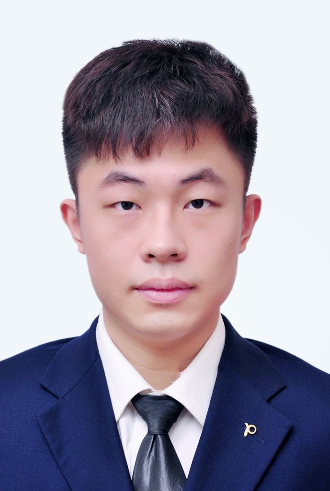
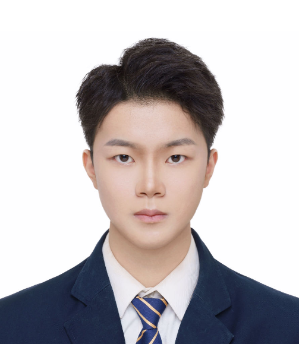








# Biography
Yuwei WU received the Ph.D. degree in computer science from Beijing Institute of Technology (BIT), Beijing, China, in 2014, under the supervision of Prof Yunde JIA. He is now a Tenured Associate Professor at School of Computer Science, BIT. From August 2014 to August 2016, he was a post-doctoral research fellow at Rapid-Rich Object Search (ROSE) Lab, School of Electrical and Electronic Engineering (EEE), Nanyang Technological University (NTU), Singapore, under the supervision of Prof TAN Yap Peng and Prof Junsong Yuan. He received outstanding Ph.D. Thesis award from BIT, and Distinguished Dissertation Award Nominee from China Association for Artificial Intelligence (CAAI). 

# Research Interests
**Computer Vision**: 3D Vision, Vision Language Processing, etc.

**Machine Learning**: Riemannian Optimization, Deep Learning, etc. 

# Recruitment
I am always looking for highly motivated Master and Ph.D. students who have excellent mathematic and programming skills to work on 3D vision, vision and language modeling, and Riemannian manifold analytics. Please do not hesitate to send me your CV, if you are interested in our group. (每年计划招收博士生2-3名，硕士生2名，欢迎对计算机视觉、多媒体分析、机器学习等领域研究有兴趣的同学加入课题组：[详细招生信息](../recruitment/媒体计算与机器智能课题组招生V3.pdf))

# News
- *2024.09*: &nbsp;🎉🎉 Two papers are accepted by NeurIPS 2024, and one paper is accepted by EMNLP 2024, congratulations to Chuanhao LI and Pengxiang LI.
- *2024.08*: &nbsp;🎉🎉 One paper concerning stereo mathching is accepted by IEEE T-CSVT, congratulations to Pengxiang LI.
- *2024.07*: &nbsp;🎉🎉 Two papers are accepted by ECCV2024, congratulations to Jiaxi ZENG and Chuanhao LI.
- *2023.12*: &nbsp;🎉🎉 One paper is accepted by AAAI2024, congratulations to Yangkai XUE. 
- *2023.10*: &nbsp;🎉🎉 Zhi GAO received Distinguished Dissertation Award from SIGAICHINA, congratulations!
- *2023.06*: &nbsp;🎉🎉 Three papers are accepted by ICCV2023, congratulations to Chenrui SHI, Jiaxi ZENG and Chengtang YAO.
- *2023.04*: &nbsp;🎉🎉 One paper is accepted by IJCAI2023, congratulations to Mingliang ZHAI.
- *2023.03*: &nbsp;🎉🎉 Two papers are accepted by CVPR2023, congratulations to Zhi GAO and Chuanhao LI.
- *2023.01*: &nbsp;🎉🎉 Chuanhao LI and Mingliang ZHAI received the second prize in the multi-modal technology innovation competition of the first "Xingzhi Cup" National Artificial Intelligence Innovation Application Competition.
- *2022.12*: &nbsp;🎉🎉 One paper is accepted by AAAI2023, congratulations to Che SUN.
- *2022.12*: &nbsp;🎉🎉 Che SUN successfully defended his Ph.D. thesis, congratulations Dr. SUN.
- *2022.10*: &nbsp;🎉🎉 Our "Learning to Optimize on Riemannian Manifolds" paper is accepted by T-PAMI, congratulations to Zhi GAO.
- *2022.09*: &nbsp;🎉🎉 Guangdong Provincial Key Laboratory of Machine Perception and Intelligent Computing was approved. Our team has another base in Shenzhen.
- *2022.08*: &nbsp;🎉🎉 One paper is accepted by NeurIPS2022, congratulations to Zhi GAO.
- *2022.07*: &nbsp;🎉🎉 One paper is accepted by ACM MM2022, congratulations to Che SUN.
- *2022.07*: &nbsp;🎉🎉 Chenchen JING received outstanding Ph.D. Thesis award from BIT, congratulations.
- *2022.07*: &nbsp;🎉🎉 Jindou DAI received outstanding Master Thesis award from BIT, congratulations.
- *2022.06*: &nbsp;🎉🎉 Chenchen JING successfully defended his Ph.D. thesis, congratulations Dr. JING.
- *2022.04*: &nbsp;🎉🎉 Our "Curvature-Adaptive Meta-Learning" paper is accepted by T-PAMI, congratulations to Zhi GAO.
- *2022.03*: &nbsp;🎉🎉 Two papers are accepted by CVPR2022, congratulations to Che SUN and Chenchen JING.
- *2021.12*: &nbsp;🎉🎉 Two papers are accepted by AAAI2022, congratulations to Chenchen JING and Xiaomeng FAN.
- *2021.07*: &nbsp;🎉🎉 Weichao SHEN received outstanding Ph.D. Thesis award from BIT, congratulations.
- *2021.06*: &nbsp;🎉🎉 Weichao SHEN successfully defended his Ph.D. thesis, congratulations Dr. SHEN.
- *2021.06*: &nbsp;🎉🎉 One paper is accepted by ICCV2021, congratulations to Zhi GAO.
- *2021.03*: &nbsp;🎉🎉 Two papers are accepted by CVPR2021, including one oral, congratulations to Chentang YAO and Jindou DAI.
- *2020.12*: &nbsp;🎉🎉 One paper is accepted by AAAI2021, congratulations to Xiaomeng FAN.
- *2020.07*: &nbsp;🎉🎉 Two papers are accepted by ACM MM2020, congratulations to Che SUN and Chenchen JING.
- *2020.07*: &nbsp;🎉🎉 Our paper about abnormal event detection is accepted by IEEE T-MM, congratulations to Che SUN.
- *2020.06*: &nbsp;🎉🎉 Yanmei DONG successfully defended her Ph.D. thesis, congratulations Dr. DONG!
- *2020.05*: &nbsp;🎉🎉 Our paper about face spoofing detection is accepted by IEEE T-IFS, congratulations to Chengtang YAO.
- *2020.02*: &nbsp;🎉🎉 One paper concerning SPD Riemannian optimization is accepted by CVPR2020, congratulations to Zhi GAO.
- *2019.11*: &nbsp;🎉🎉 Two papers are accepted by AAAI2020, congratulations to Zhi GAO and Chenchen JING.
- *2019.11*: &nbsp;🎉🎉 Zhi GAO’s work on the SPD Manifold is accepted by IEEE Transactions on Neural Networks and Learning Systems (T-NNLS), congratulations!
- *2019.07*: &nbsp;🎉🎉 Lidong YU received outstanding Master Thesis award from BIT, congratulations!
- *2019.06*: &nbsp;🎉🎉 Lidong YU, Lijia ZHANG, and Wenji WANG successfully defended their Master thesis, congratulations!
- *2019.06*: &nbsp;🎉🎉 Weichao SHEN’s work on 3D shape reconstruction is presented at CVPR'19 as an oral paper.
- *2019.03*: &nbsp;🎉🎉 One paper is accepted by CVPR'19 as an oral paper, congratulations to Weichao SHEN.
- *2019.02*: &nbsp;🎉🎉 Two papers are published on Patter Recognition (PR), congratulations to Xingyuan BU and Zhi GAO.

# Selected Publications 

NeurIPS 2024

**UDKAG: Augmenting Large Vision-Language Models with Up-to-Date Knowledge**
- Chuanhao Li, Zhen Li, Chenchen Jing, Shuo Liu, Wenqi Shao, **Yuwei Wu**, Ping Luo, Yu Qiao, and Kaipeng Zhang.
- NeurIPS 2024
  
  [[PDF](../paper/NIPS2024_CHUANHAO.pdf)]

NeurIPS 2024

**FIRE: A Dataset for Feedback Integration and Refinement Evaluation of Multimodal Models**
- Pengxiang Li, Zhi Gao, Bofei Zhang, Tao Yuan, **Yuwei Wu**, Mehrtash Harandi, Yunde Jia, Song-Chun Zhu, and Qing Li.
- NeurIPS 2024
  
  [[PDF](../paper/NIPS2024_PENGXIANG.pdf)]

EMNLP 2024

**In-Context Compositional Generalization for Large Vision-Language Models**
- Chuanhao Li, Chenchen Jing, Zhen Li, Mingliang Zhai, **Yuwei Wu**, and Yunde Jia.
- EMNLP 2024
  
  [[PDF](../paper/EMNLP2024_CHUANHAO.pdf)]

T-CSVT 2024

**Inter-Scale Similarity Guided Cost Aggregation for Stereo Matching**
- Pengxiang Li, Chengtang Yao, and Yunde Jia.
- T-CSVT 2024
  
  [[PDF](../paper/TCSVT2024_PENGXIANG.pdf)]

ECCV 2024

**Temporally Consistent Stereo Matching**
- Jiaxi Zeng, Chengtang Yao, **Yuwei Wu**, and Yunde Jia.
- ECCV 2024
  
  [[PDF](../paper/ECCV2024_JIAXI.pdf)] [[Project](https://github.com/jiaxiZeng/Temporally-Consistent-Stereo-Matching)]

ECCV 2024

**Compositional Substitutivity of Visual Reasoning for Visual Question Answering**
- Chuanhao Li, Zhen Li, Chenchen Jing, **Yuwei Wu**, Mingliang Zhai, and Yunde Jia.
- ECCV 2024 

  [[PDF](../paper/ECCV2024_CHUANHAO.pdf)] [[Project](https://github.com/NeverMoreLCH/CG-SPS)]

AAAI 2024

**Residual Hyperbolic Graph Convolution Networks**
- Yangkai Xue, Jindou Dai, Zhipeng Lu, **Yuwei Wu**, and Yunde Jia
- AAAI 2024 
  
  [[PDF](../paper/AAAI2024_Xue.pdf)]

ICCV 2023

  **Video Anomaly Detection via Sequentially Learning Multiple Pretext Tasks**
- Chenrui Shi, Che Sun, Yunde Jia, and **Yuwei Wu**
- ICCV 2023 
  
  [[PDF](../paper/ICCV2023_Chenrui.pdf)]

ICCV 2023

  
**Parameterized Cost Volume for Stereo Matching**
- Jiaxi Zeng, Chengtang Yao, Lidong Yu, Yunde Jia, and **Yuwei Wu**
- ICCV 2023

  [[PDF](../paper/ICCV2023_Zeng.pdf)] [[Project](https://github.com/jiaxiZeng/Parameterized-Cost-Volume-for-Stereo-Matching)]

ICCV 2023

**Sparse Point Guided 3D Lane Detection**

- Chengtang Yao, Lidong Yu, Yunde Jia, and **Yuwei Wu**
- ICCV 2023

  [[PDF](../paper/ICCV2023_Yao.pdf)] [[Project](https://github.com/YaoChengTang/Sparse-Point-Guided-3D-Lane-Detection)]

IJCAI 2023

**An Efficient Hourglass Transformer with Modality-guided Dynamic Token Merge for Document Understanding**

- Mingliang Zhai, Yulin Li, Xiameng Qin, Chen Yi, Qunyi Xie, Chengquan Zhang, Kun Yao, **Yuwei Wu**, and Yunde Jia
- IJCAI 2023

  [[PDF](../paper/IJCAI2023_Zhai.pdf)]

CVPR 2023

**Exploring the Effect of Primitives for Compositional Generalization in Vision-and-Language**

- Chuanhao Li, Zhen Li, Chenchen Jing, Yunde Jia, and **Yuwei Wu**
- CVPR 2023

  [[PDF](../paper/CVPR2023_Chuanhao.pdf)]

CVPR 2023

**Exploring Data Geometry for Continual Learning**

- Zhi Gao, Chen Xu, Feng Li, Yunde Jia, Mehrtash Harandi, and **Yuwei Wu**
- CVPR 2023
  
  [[PDF](../paper/CVPR2023_Gao.pdf)]

AAAI 2023

**Learning Event-Relevant Factors for Video Anomaly Detection**

- Che Sun, Chenrui Shi, Yunde Jia, and **Yuwei Wu**
- AAAI 2023
  
  [[PDF](../paper/AAAI2023_Sun.pdf)]

T-PAMI 2023

**Curvature-Adaptive Meta-Learning for Fast Adaptation to Non-Euclidean Data**

- Zhi Gao, **Yuwei Wu**, Mehrtash Harandi, and Yunde Jia
- T-PAMI 2023

  [[PDF](../paper/TPAMI2023_Gao_Curvature-Adaptive-Meta-Learning.pdf)]

T-PAMI 2023

**Learning to Optimize on Riemannian Manifolds**

- Zhi Gao, **Yuwei Wu**, Xiaomeng Fan, Mehrtash Harandi, and Yunde Jia
- T-PAMI 2023

  [[PDF](../paper/TPAMI2023_Gao_Learning_to_Optimize.pdf)] [[Project](https://github.com/zhigao2017/learningriemannianoptimization)]

NeurIPS 2022

**Hyperbolic Feature Augmentation via Distribution Estimation and Infinite Sampling on Manifolds**

- Zhi Gao, **Yuwei Wu**,Yunde Jia, and Mehrtash Harandi
- NeurIPS 2022

  [[PDF](../paper/NeuRIPS2022_Gao.pdf)] [[Project](https://github.com/zhigao2017/Hyperbolic_Feature_Augmentation)]

ACM MM 2022

**Evidential Reasoning for Video Anomaly Detection**

- Che Sun, Yunde Jia, and **Yuwei Wu**
- ACM MM 2022

  [[PDF](../paper/ACM_MM2022_Sun.pdf)]

CVPR 2022

**Global-Aware Registration of Less-Overlap RGB-D Scans**

- Che Sun, Yunde Jia, Yi Guo, and **Yuwei Wu**
- CVPR 2022

  [[PDF](../paper/CVPR2022_Sun.pdf)]

CVPR 2022

**Maintaining Reasoning Consistency in Compositional Visual Question Answering**

- Chenchen Jing, Yunde Jia, **Yuwei Wu**, Xinyu Liu, and Qi Wu
- CVPR 2022

  [[PDF](../paper/CVPR2022_Jing.pdf)] [[Project](https://github.com/jingchenchen/ReasoningConsistency-VQA)]

AAAI 2022

**Efficient Riemannian Meta-Optimization by Implicit Differentiation**

- Xiaomeng Fan, **Yuwei Wu**, Zhi Gao, Yunde Jia, and Mehrtash Harandi
- AAAI 2022

  [[PDF](../paper/AAAI2022_Fan.pdf)] [[Project](https://github.com/XiaomengFanmcislab/I-RMM)]

AAAI 2022

**Learning the Dynamics of Visual Relational Reasoning via Reinforced Path Routing**

- Chenchen Jing, Yunde Jia, **Yuwei Wu**, Chuanhao Li, and Qi Wu
- AAAI 2022

  [[PDF](../paper/AAAI2022_.Jing.pdf)]

PR 2022

**Infinite-dimensional feature aggregation via a factorized bilinear model**

- Jindou Dai, **Yuwei Wu**, Zhi Gao, and Yunde Jia
- PR 2022

  [[PDF](../paper/PR2022_Dai.pdf)] 

T-MM 2021

**Adversarial 3D Convolutional Auto-Encoder for Abnormal Event Detection in Videos**

- Che Sun, Yunde Jia, Hao Song, and **Yuwei Wu**
- T-MM 2021

  [[PDF](../paper/TMM2021_Sun.pdf)]

ICCV 2021

**Curvature Generation in Hyperbolic Spaces for Few-Shot Learning**

- Zhi Gao, **Yuwei Wu**, Yunde Jia, and Mehrtash Harandi
- ICCV 2021

  [[pdf](../paper/ICCV2021_Gao.pdf)] [[Project](https://github.com/zhigao2017/CurvatureGeneration_FSL)]

CVPR 2021 (Oral)

**A Hyperbolic-to-Hyperbolic Graph Convolutional Network**

- Jindou Dai, **Yuwei Wu**, Zhi Gao, and Yunde Jia
- CVPR 2021

  [[PDF](../paper/CVPR2021_Dai.pdf)]

CVPR 2021

**A Decomposition Model for Stereo Matching**

- Chengtang Yao, Yunde Jia, Huijun Di, Pengxiang Li, and **Yuwei Wu**
- CVPR 2021

  [[PDF](../paper/CVPR2021_Yao.pdf)] [[Project](https://github.com/YaoChengTang/DecNet)]

AAAI 2021

**Learning a Gradient-free Riemannian Optimizer on Tangent Spaces**

- Xiaomeng Fan, Zhi Gao, **Yuwei Wu**, Yunde Jia, and Mehrtash Harandi
- AAAI 2021

  [[PDF](../paper/AAAI2021_Fan.pdf)] [[Project](https://github.com/XiaomengFanmcislab/Learning-a-Gradient-free-Riemannian-Optimizer-on-Tangent-Spaces)]

ACM MM 2020

**Scene-Aware Context Reasoning for Unsupervised Abnormal Event Detection in Videos**

- Che Sun, Yunde Jia, Yao Hu, and **Yuwei Wu**
- ACM MM 2020

  [[PDF](../paper/ACM_MM2020_Sun.pdf)]

ACM MM 2020

**Visual-Semantic Graph Matching for Visual Grounding**

- Chenchen Jing, **Yuwei Wu**, Yao Hu, Yunde Jia, and Qi Wu
- ACM MM 2020

  [[PDF](../paper/ACM_MM2020_Jing.pdf)]

CVPR 2020

**Learning to Optimize on SPD Manifolds**

- Zhi Gao, **Yuwei Wu**, Yunde Jia, and Mehrtash Harandi
- CVPR 2020

  [[PDF](../paper/CVPR2020_Gao.pdf)] [[Project](https://github.com/zhigao2017/Learning-to-optimize-on-SPD-manifolds)]

AAAI 2020

**Revisiting Bilinear Pooling: A Coding Perspective**

- Zhi Gao, **Yuwei Wu**, XiaoxunZhang, Jindou Dai,Yunde Jia, and Mehrtash Harandi
- AAAI 2020

  [[PDF](../paper/AAAI2020_Gao.pdf)] [[Project](https://github.com/zhigao2017/Learning-to-optimize-on-SPD-manifolds)]

AAAI 2020

**Overcoming Language Priors in VQA via Decomposed Linguistic Representations**

- Chenchen Jing, **Yuwei Wu**, XiaoxunZhang, Yunde Jia, and Qi Wu
- AAAI 2020

  [[PDF](../paper/AAAI2020_Jing.pdf)]

T-NNLS 2020

**A Robust Metric for Similarity-based Classification on the SPD Manifold**

- Zhi Gao, **Yuwei Wu**, Mehrtash Harandi, and Yunde Jia
- T-NNLS 2020

  [[PDF](../paper/TNNLS2020.pdf)] [[Project](https://github.com/zhigao2017/PSSSD)]

T-IFS 2020

**Face Spoofing Detection Using Relativity Representation on Riemannian Manifold**

- Chengtang Yao, Yunde Jia, Huijun Di, and **Yuwei Wu**
- T-IFS 2020

  [[PDF](../paper/TIFS2020_Yao.pdf)]

CVPR 2019

**3D Shape Reconstruction from Images in the Frequency Domain**

- Weichao Shen, **Yuwei Wu**, and Yunde Jia
- CVPR 2019 **(Oral)**

  [[PDF](../paper/CVPR2019_3D_Shape_Reconstruction_from_Images_in_the_Frequency_Domain.pdf)]

T-CSVT 2019

**Robust Distracter-Resistive Tracker via Learning A Multi-component Discriminative Dictionary**

- Weichao Shen, **Yuwei Wu**, Junsong Yuan, Ling-Yu Duan, Jian Zhang, and Yunde  Jia
- T-CSVT 2019

  [[PDF](../paper/TCSVT2019_Shen.pdf)]

  

    

      
PR 2019

      
    

  

  

  **Deep Convolutional Network with Locality and Sparsity Constraints Texture Classification**
  
  - Xingyuan Bu, **Yuwei Wu**, Zhi Gao, and Yunde Jia
  - PR 2019

    [[PDF](../paper/PR2019_Xingyuan.pdf)] 

  

  

    

      
PR 2019

      
    

  

  

  **Learning a Robust Representation via a Deep Network on Symmetric Positive Definite Manifolds**
  
  - Zhi Gao, **Yuwei Wu**, Xingyuan Bu, Tan Yu, Junsong Yuan, and Yunde Jia
  - PR 2019

    [[PDF](../paper/PR2019_Gaozhi.pdf)] [[Project](https://github.com/zhigao2017/Kernel-SPD-Pooling)]

  

  

    

      
T-MM 2019

      
    

  

  

  **A Codebook-free Compact Descriptor via Dual Selection for Visual Search**
  
  - **Yuwei Wu**, Feng Gao, Yicheng Huang, Jie Lin, Vijay Chandrasekhar, Junsong Yuan, and Ling-Yu Duan
  - T-MM 2019

    [[PDF](../paper/TMM2019_Codebook-free_Compact_Descriptor_for_Scalable_Visual_Search.pdf)]

  

  

    

      
T-MM 2019

      
    

  

  

  **Temporal Action Localization in Untrimmed Videos using Action Pattern Trees**
  
  - Hao Song, Xinxiao Wu, Bing Zhu, **Yuwei Wu**, Mei Chen, and Yunde Jia
  - T-MM 2019

    [[PDF](../paper/TMM2019_Temporal_Action_Localization.pdf)]

  

  

    

      
IROS 2019

      
    

  

  

  **Person-following for Telepresence Robots Using Web Cameras**
  
  - Xianda Cheng, Yunde Jia, Jingyu Su, and **Yuwei Wu**
  - IROS 2019

    [[PDF](../paper/IROS2019.pdf)]

  

  

    

      
T-IP 2018

      
    

  

  

  **Minimizing Reconstruction Bias Hashing via Joint Projection and Quantization**
  
  - Ling-Yu Duan, **Yuwei Wu**, Yicheng Huang, Zhe Wang, Junsong Yuan, and Wen Gao
  - T-IP 2018

    [[PDF](../paper/TIP2018_Minimizing_Reconstruction_Bias_Hashing.pdf)]

  

  

    

      
T-MM 2018

      
    

  

  

  **Group Sensitive Triplet Embedding for Vehicle Re-identification**
  
  - Yan Bai, Yihang Lou, Feng Gao, Shiqi Wang, **Yuwei Wu**, and Ling-Yu Duan
  - T-MM 2018

    [[PDF](../paper/TMM2018_Group-Sensitive_Triplet_Embedding.pdf)]

  

  

    

      
AAAI 2018

      
    

  

  

  **Deep Stereo Matching with Explicit Cost Aggregation Sub-Architecture**
  
  - Lidong Yu, Yucheng Wang, **Yuwei Wu**, and Yunde Jia
  - AAAI 2018

    [[PDF](../paper/AAAI2018_Deep_Stereo_Matching_with_Explicit.pdf)]

  

  

    

      
T-IP 2017

      
    

  

  

  **A Hybrid Data Association Framework for Robust Online Multi-Object Tracking**
  
  - Min Yang, **Yuwei Wu**, and Yunde Jia
  - T-IP 2017
  
    [[PDF](../paper/TIP2017_A_Hybrid_Data_Association_Framework.pdf)]

  

CVPR 2017

**HOPE: Hierarchical Object Prototype Encoding for Efficient Object Instance Search in Videos**

- Tan Yu, **Yuwei Wu**, Junsong Yuan
- CVPR 2017

  [[PDF](../paper/CVPR2017_HOPE_Hierarchical_Object_Prototype_Encoding_.pdf)]

AAAI 2017

**Efficient Object Instance Search Using Fuzzy Objects Matching**

- Tan Yu, **Yuwei Wu**, Sreyasee Das Bhattacharjee, Junsong Yuan
- AAAI 2017

  [[PDF](https://cse.buffalo.edu/~jsyuan/papers/2017/Efficient%20Object%20Instance%20Search%20Using%20Fuzzy%20Objects%20Matching.pdf)]

AAAI 2017

**Deep Manifold Learning of Symmetric Positive Definite Matrices with Application to Face Recognition**

- Zhen Dong, Su Jia, Chi Zhang, Mingtao Pei, **Yuwei Wu**
- AAAI 2017

  [[PDF](../paper/AAAI2017_Deep_Manifold_Learning_of_Symmetric_Positive_Definite_Matrices.pdf)]

T-CSVT 2016

**Online Discriminative Tracking with Active Example Selection**

- Min Yang, **Yuwei Wu**, Mingtao Pei, Bo Ma, and Yunde Jia
- T-CSVT 2016

  [[PDF](https://drive.google.com/file/d/1H1TPSrGWo-mOXqj9CwPZLvHCrd7O7_nd/view)]

T-IP 2015

**Robust Discriminative Tracking via Landmark-based Label Propagation**

- **Yuwei Wu**, Mingtao Pei, Min Yang, Junsong Yuan, and Yunde Jia
- T-IP 2015

  [[PDF](../paper/TIP2015_Robust_Discriminative_Tracking_via_Landmark-based_Label_Propagation.pdf)]

T-IP 2015

**Manifold kernel Sparse Representation of Symmetric Positive Definite Matrices and Its Applications**

- **Yuwei Wu**, Yunde Jia, Peihua Li, Jian Zhang, and Junsong Yuan
- T-IP 2015

  [[PDF](../paper/TIP2015_Manifold_Kernel_Sparse_Representation_of_Symmetric_Positive-Definite_Matrices_and_Its_Applications.pdf)]

T-ITS 2015

**Vehicle Type Classification Using Semi-Supervised Convolutional Neural Network**

- Zhen Dong, **Yuwei Wu**, Mingtao Pei, and Yunde Jia
- T-ITS 2015

  [[PDF](../paper/TITS2015_Vehicle_Type_Classification_Using_a_Semisupervised.pdf)]

T-CSVT 2014

**Metric learning based Structural Appearance Model for Robust Visual Tracking**

- **Yuwei Wu**, Bo Ma, Min Yang, Yunde Jia, and Jian Zhang
- T-CSVT 2014

  [[PDF](https://drive.google.com/file/d/1Sgnz99TFyvrDeOyYN5FISIiMNngNlTBr/view)]

 

# Teaching

- School of CS, Beijing Institute of Technology (BIT), **Digital Image Processing**, 2020-present,  1st semester

- School of CS, Beijing Institute of Technology (BIT), **Programming Methods and Practice**, 2018-present, Summer semester

# Group

## Graduate Students

<!-- 第一行 -->

    <!-- 第一个成员 -->
    

        
        
<strong>Chuanhao LI (李川皓)</strong>

        
Ph.D. student of BIT

        
2020--

    

    
    <!-- 第二个成员 -->
    

        
        
<strong>Xu CHEN (陈旭)</strong>

        
Ph.D. student of BIT

        
2020--

    

    
    <!-- 第三个成员 -->
    

        
        
<strong>Chengtang YAO (姚承唐)</strong>

        
Ph.D. student of BIT

        
2021--

    

<!-- 第二行 -->

    <!-- 第一个成员 -->
    

        
        
<strong>Guichen HUANG (黄贵宸)</strong>

        
Ph.D. student of BIT

        
2021--

    

    
    <!-- 第二个成员 -->
    

        
        
<strong>Xiaomeng FAN (范啸猛)</strong>

        
Ph.D. student of BIT

        
2022--

    

    
    <!-- 第三个成员 -->
    

        
        
<strong>Yi GUO (郭一)</strong>

        
Ph.D. student of BIT

        
2022--

    

<!-- 第三行 -->

    <!-- 第一个成员 -->
    

        
        
<strong>Pengxiang LI (李朋祥)</strong>

        
Ph.D. student of BIT

        
2023--

    

    
    <!-- 第二个成员 -->
    

        
        
<strong>Mingliang ZHAI (翟明亮)</strong>

        
Ph.D. student of BIT

        
2023--

    

    
    <!-- 第三个成员 -->
    

        
        
<strong>Chenrui SHI (石辰睿)</strong>

        
Ph.D. student of BIT

        
2023--

    

<!-- 第四行 -->

    <!-- 第一个成员 -->
    

        
        
<strong>Zhiyu YAN (晏直誉)</strong>

        
Master student of BIT

        
2021--

    

    
    <!-- 第二个成员 -->
     

        
        
<strong>Peilin YU (余沛霖)</strong>

        
Master student of BIT

        
2022--

    

    
    <!-- 第三个成员 -->
     

        
        
<strong>Yangkai XUE (薛阳凯)</strong>

        
Master student of BIT

        
2022--

    

<!-- 第五行 -->

    <!-- 第一个成员 -->
    

        
        
<strong>Xinyu LIU (刘新宇)</strong>

        
Master student of BIT

        
2022--

    

    
    <!-- 第二个成员 -->
     

        
        
<strong>Jiaxi ZENG (曾嘉禧)</strong>

        
Master student of BIT

        
2022--

    

    
    <!-- 第三个成员 -->
     

        
        
<strong>Zhaoyi LI (李昭驿)</strong>

        
Master student of BIT

        
2023--

    

<!-- 第六行 -->

    <!-- 第一个成员 -->
    

        
        
<strong>Zhen LI (李祯)</strong>

        
Master student of BIT

        
2023--

    

    
    <!-- 第二个成员 -->
     

        
        
<strong>Zhidan LIU (刘志丹)</strong>

        
Master student of BIT

        
2023--

    

    
    <!-- 第三个成员 -->
     

        
        
<strong>Yuchuan MAO (毛禹川)</strong>

        
Master student of BIT

        
2023--

    

<!-- 第六行 -->

    <!-- 第一个成员 -->
    

        
        
<strong>Rui GAO (高瑞)</strong>

        
Master student of BIT

        
2023--

    

    
    <!-- 第二个成员 -->
     

        
        
<strong>Yimeng FAN (范忆萌)</strong>

        
Master student of BIT

        
2023--

    

    
    <!-- 第三个成员 -->
     

        
        
<strong>Hanwen ZHANG (张瀚文)</strong>

        
Master student of BIT

        
2023--

    

<!-- 第七行 -->

    <!-- 第一个成员 -->
    

        
        
<strong>Wenbo YE (叶文博)</strong>

        
Master student of BIT

        
2023--

    

    
    <!-- 第二个成员 -->
     

        
        
<strong>Quan CHEN (陈全)</strong>

        
Prospective master student of BIT

        
2024--

    

    
    <!-- 第三个成员 -->
     

        
        
<strong>Wei WU (吴为)</strong>

        
Prospective master student of BIT

        
2024--

    

 

## Previous Graduate Students

 

<strong>Dr.Zhi GAO (高志)</strong> 

Ph.D. student of BIT,2023

now: Postdoc Research Fellow, Peking University, Beijing, China

 

<strong>Dr.Che SUN (孙澈)</strong>

Ph.D. student of BIT,2023 (co-supervise with Prof. Yunde Jia) 

now: Postdoc Research Fellow, Tsinghua University, Beijing, China 

 

<strong>Dr. Chenchen JING (景宸琛)</strong>

Ph.D. student of BIT, 2022 (co-supervise with Prof. Yunde Jia) 

now: Postdoc Research Fellow, Zhejiang University, Hangzhou, China

 

<strong>Dr. Weichao SHEN (沈伟超)</strong>

Ph.D. student of BIT, 2021 (co-supervise with Prof. Yunde Jia) 

now: Alibaba DAMO Academy for Discovery, Beijing, China 

 

<strong>Wei JIANG (姜玮)</strong>

Master student of BIT, 2020

now: Alibaba, Beijing, China

 

<strong>Jindou DAI (戴金豆)</strong>

Master student of BIT, 2022

now: Alibaba, Beijing, China

 

<strong>Jingyu SU (苏静宇)</strong>

Master student of BIT, 2022

now: Putian University, Putian, China

 

<strong>Xiangjun GAO (高祥君)</strong>

Master student of BIT, 2023

now: Ph.D. student of HKUST, Hong Kong, China

 

<strong>Tianshuo MA (马天朔)</strong>

Master student of BIT, 2023

now: CASIC No.3, Beijing, China

